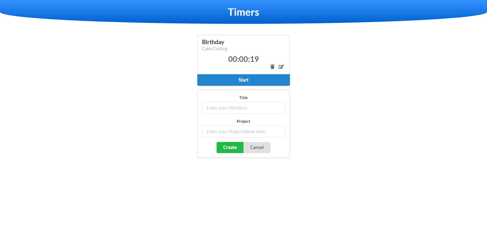

# REACT_TIME_TRACKER
Time tracking app is perfect app showing complete CRUD operations and which lets you track time depending Title and project. (which you can change in source if you want different parameters).
Project is live at https://mern-time-tracker.herokuapp.com/

  

## Available Scripts

In the project directory, you can run:

### `npm start`

Starts the node server in production environment. 
Open [http://localhost:8080](http://localhost:8080) to view it in the browser.

### `npm run start2`

Starts the node server in development environment. 
Open [http://localhost:8080](http://localhost:8081) to view it in the browser.
